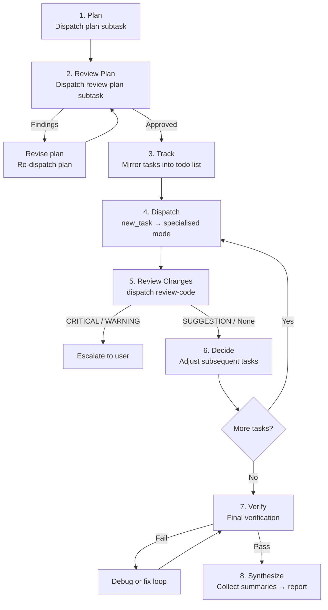

# AI-Snippets: Skills and Agent Mode Synergy

A workspace where **Roo Code agent modes** collaborate as a multi-agent system and **local skills** drive end-to-end autonomous workflows. This document explains how the pieces fit together.

---

## 1. Overview

The workspace defines two complementary building blocks:

| Layer | What it is | Example |
|-------|-----------|---------|
| **Agent modes** | Specialised Roo Code subagents, each scoped to a single responsibility (planning, coding, reviewing, debugging, etc.) | [`plan`](agents/modes.yaml:2), [`code`](agents/modes.yaml:457), [`orchestrator`](agents/modes.yaml:227) |
| **Local skills** | Reusable prompt-driven runbooks that tell an orchestrator which steps to execute and in what order | [`github-issue`](skills/github-issue.md:1) |

A **skill** (like `github-issue`) is the *what* — a high-level workflow specification.  
An **orchestrator mode** is the *how* — it knows how to break that workflow into delegated subtasks across the other modes.

Together they form a system where a single human instruction (e.g. "resolve issue #42") triggers an autonomous plan → implement → review → verify → PR cycle without further human input.

---

## 2. The Orchestrator's Work Loop

The orchestrator mode ([`orchestrator`](agents/modes.yaml:227)) never writes code itself. It acts as a strategic coordinator, delegating every concrete action to a specialised subtask and retaining only orchestration-level context. Its workflow follows a fixed loop:



### Step-by-step

| Step | Mode(s) delegated to | Purpose |
|------|---------------------|---------|
| **Plan** | [`plan`](agents/modes.yaml:2) | Investigate codebase, design solution, produce ordered implementation tasks |
| **Review Plan** | [`review-plan`](agents/modes.yaml:387) | Check plan for completeness, feasibility, correctness; iterate until approved |
| **Track** | *(orchestrator internal)* | Mirror plan tasks into the todo list; respect dependency order |
| **Dispatch** | [`code`](agents/modes.yaml:457), [`debug`](agents/modes.yaml:478), etc. | Spawn a subtask per implementation task with scope, context, definition of done |
| **Review Changes** | [`review-code`](agents/modes.yaml:152) | After each subtask, review only that task's diff for bugs, performance, style |
| **Decide** | *(orchestrator internal)* | Use summaries to adjust remaining tasks or replan if the plan is invalidated |
| **Verify** | [`code`](agents/modes.yaml:457), [`debug`](agents/modes.yaml:478) | Final end-to-end verification; dispatch `debug` for non-obvious failures, `code` for known fixes |
| **Synthesize** | *(orchestrator internal)* | Collect all subtask summaries into a final human-readable report |

### Failure handling

When verification fails the orchestrator follows a decision tree:

1. Obvious, in-scope failure → let `code` fix it.
2. Unclear or out-of-scope → dispatch `debug`.
3. `debug` finds implementation fix → dispatch `code`.
4. `debug` finds design issue → dispatch `plan` (replan).
5. Requires human decision → escalate to user.
6. Re-verify after every fix.

---

## 3. End-to-End Autonomous Issue Resolution with `github-issue`

The [`github-issue`](skills/github-issue.md:1) skill combines the orchestrator's loop with GitHub operations to resolve a GitHub issue completely autonomously — from intake to pull request.

### The full autonomous pipeline

| Phase | What happens | Modes involved |
|-------|-------------|----------------|
| **1. Retrieve & Validate** | Fetch issue, comments, labels, linked PRs via `gh`. Stop if ambiguous. | orchestrator (reads only) |
| **2. Feature Branch** | Create a branch referencing the issue. No code yet. | orchestrator (git via `execute_command`) |
| **3. Plan** | Investigate codebase, design solution, decompose into tasks. | orchestrator → `plan` → `review-plan` |
| **4. Implement** | Execute each plan task sequentially. | orchestrator → `code` (per task) |
| **5. Review** | After every task, review the diff. | orchestrator → `review-code` |
| **6. Verify** | Run tests, checks, confirm definition of done. | orchestrator → `code` / `debug` |
| **7. Commit, Push, PR** | Review final diff, commit, push, open PR referencing the issue. | orchestrator (git/gh via `execute_command`) |
| **8. Report** | Summarize branch, implementation, tests, PR link, limitations. | orchestrator (synthesis) |

### What makes this autonomous

- The skill defines **every phase** as a deterministic step — no human prompting is required between phases.
- The orchestrator delegates **all implementation** to subtasks; it never writes code itself, keeping context lean.
- Auto-approval settings in the workspace (`alwaysAllowSubtasks: true`, `autoApprovalEnabled: true`) allow subtasks to execute without manual confirmation.
- The `gh` CLI handles all GitHub interactions (issue retrieval, branch creation, PR creation) without browser or API key prompts.

### The one hard stop

If the original issue contains **material ambiguity** that cannot be resolved from the codebase, comments, or linked references, the skill instructs the orchestrator to **stop immediately** — do not guess, do not modify the repository. This is a deliberate safety valve.

---

## 4. ⚠️ Caveat: Model Selection Matters

**This autonomous pipeline only works reliably if the models backing each mode are chosen carefully.** The orchestrator delegates context-heavy decisions to subtasks; each subtask runs in isolation with only the context it was given. If a subtask is backed by a weak model, the failure mode is silent and cascading.

### What "strong" and "weak" mean here

| Role | Needs | Why |
|------|-------|-----|
| **orchestrator** | Strong reasoning, structured output | Must decompose problems, track state across subtasks, decide next steps from summaries |
| **plan / review-plan** | Strong reasoning, codebase comprehension | Must investigate files, understand architecture, produce actionable task lists |
| **review-code / security-review** | Strong reasoning, attention to detail | Must find real bugs (not style nits), trace data flow, assess exploitability |
| **code** | Strong coding ability, instruction following | Must implement precisely within scope, write tests, run verification |
| **debug** | Strong reasoning + coding | Must hypothesise root causes from limited info, propose targeted fixes |

### What breaks with weak models

| Weak model assigned to… | Failure symptom |
|------------------------|-----------------|
| **orchestrator** | Loses track of subtask results; replans unnecessarily; fails to escalate when it should; dispatches tasks with missing context |
| **plan** | Produces vague, unactionable tasks; misses files; wrong dependency ordering |
| **review-plan** | Approves broken plans; misses CRITICAL findings |
| **code** | Implements outside scope; ignores conventions; skips verification |
| **review-code** | Reports style nits but misses logic bugs; misses security issues |
| **debug** | Hypothesises wrong root causes; applies incorrect fixes; loops indefinitely |

**Rule of thumb:** The orchestrator and planning/review roles are the highest-leverage model assignments. A weak orchestrator breaks the entire system. A weak coder breaks one task; the orchestrator's review loop can catch and recover from that.

---

## 5. Mode → Model Mapping

The model assignments are configured in [`roo-code-settings.json`](/home/werner/roo-code-settings.json) under `modeApiConfigs`. The workspace defines two API providers via OmniRoute at `brainbox:20128`:

| Provider profile | Model ID | Notes |
|-----------------|----------|-------|
| OmniRoute - DeepSeekV4Pro | `DeepSeek-v4-Pro` | 128k context, reasoning model, reasoning effort: low |
| owl-then-qwen | `owl-then-qwencoder` | 128k context, encoder-style model |

### Mode → Model table

| Mode | Slug | Assigned Model | Rationale / Notes |
|------|------|----------------|-------------------|
| 🪃 Orchestrator | `orchestrator` | **DeepSeek V4 Pro** | Reasoning model for coordination decisions |
| 💻 Code | `code` | **owl-then-qwencoder** | Coding model for implementation tasks |
| 🪲 Debug | `debug` | **owl-then-qwencoder** | Same coding model for investigation and fixes |
| ❌ Architect *(deprecated)* | `architect` | *(unmapped — configuration reference exists but provider profile not defined)* | Deprecated; replaced by `plan` |
| ❓ Ask | `ask` | *(unmapped — configuration reference exists but provider profile not defined)* | Default model |
| 📋 Planner | `plan` | **default / unassigned** | No explicit mapping; uses the global default model |
| 👀 Review Code | `review-code` | **default / unassigned** | No explicit mapping; uses the global default model |
| 📋 Review Plan | `review-plan` | **default / unassigned** | No explicit mapping; uses the global default model |
| 🛡️ Security Review | `security-review` | **default / unassigned** | No explicit mapping; uses the global default model |

### Impact on autonomy

The current configuration maps the orchestrator to a strong reasoning model (DeepSeek V4 Pro) and `code`/`debug` to an encoder model (owl-then-qwen). However, **`plan`, `review-plan`, `review-code`, and `security-review` have no explicit model mapping** and fall back to the global default. For fully autonomous operation to be reliable, these roles should be backed by models with:

- **`plan` / `review-plan`**: Strong reasoning capability (comparable to the orchestrator's model) — these roles require codebase investigation and architectural judgement.
- **`review-code` / `security-review`**: Strong reasoning and attention to detail — these roles must identify real bugs and security issues, not just surface-level style concerns.

Until explicit mappings are configured for these roles, the autonomous pipeline may produce incomplete plans or miss findings during review, requiring human intervention.

---

## Workspace Structure

```
.
├── README.md                  ← this file
├── LICENSE
├── agents/
│   └── modes.yaml             ← all custom mode definitions
└── skills/
    └── github-issue.md        ← github-issue skill runbook
```

Global Roo Code rules and the installed `github-issue` skill are located under `~/.roo/`:

```
~/.roo/
├── rules/
│   ├── 01-documentation.md
│   ├── 04-git.md
│   └── 06-hosts.md
└── skills/
    └── github-issue/
        └── SKILL.md
```
