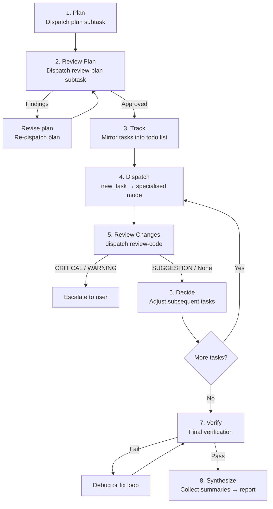

# AI-Snippets: Skills and Agent Mode Synergy

A workspace where **Zoo Code agent modes** collaborate as a multi-agent system and **local skills** drive end-to-end autonomous workflows. This document explains how the pieces fit together.

---

## 1. Overview

The workspace defines two complementary building blocks:

| Layer | What it is | Example |
|-------|-----------|---------|
| **Agent modes** | Specialised Zoo Code subagents, each scoped to a single responsibility (planning, coding, reviewing, debugging, etc.) | [`plan`](agents/modes.yaml:2), [`code`](agents/modes.yaml:457), [`orchestrator`](agents/modes.yaml:227) |
| **Local skills** | Reusable prompt-driven runbooks that tell an orchestrator which steps to execute and in what order | [`github-issue`](skills/github-issue.md:1) |

A **skill** (like `github-issue`) is the *what* — a high-level workflow specification.  
An **orchestrator mode** is the *how* — it knows how to break that workflow into delegated subtasks across the other modes.

Together they form a system where a single human instruction (e.g. "resolve issue #42") triggers an autonomous plan → implement → review → verify → PR cycle without further human input.

---

## 2. The Orchestrator's Work Loop

The orchestrator mode ([`orchestrator`](agents/modes.yaml:227)) never writes code itself. It acts as a strategic coordinator, delegating every concrete action to a specialised subtask and retaining only orchestration-level context. Its workflow follows a fixed loop:



### Step-by-step

| Step | Mode(s) delegated to | Purpose |
|------|---------------------|---------|
| **Plan** | [`plan`](agents/modes.yaml:2) | Investigate codebase, design solution, produce ordered implementation tasks |
| **Review Plan** | [`review-plan`](agents/modes.yaml:387) | Check plan for completeness, feasibility, correctness; iterate until approved |
| **Track** | *(orchestrator internal)* | Mirror plan tasks into the todo list; respect dependency order |
| **Dispatch** | [`code`](agents/modes.yaml:457), `debug`, etc. | Spawn a subtask per implementation task with scope, context, definition of done |
| **Review Changes** | [`review-code`](agents/modes.yaml:152) | After each subtask, review only that task's diff for bugs, performance, style |
| **Decide** | *(orchestrator internal)* | Use summaries to adjust remaining tasks or replan if the plan is invalidated |
| **Verify** | [`code`](agents/modes.yaml:457), `debug` | Final end-to-end verification; dispatch `debug` for non-obvious failures, `code` for known fixes |
| **Synthesize** | *(orchestrator internal)* | Collect all subtask summaries into a final human-readable report |

### Failure handling

When verification fails the orchestrator follows a decision tree:

1. Obvious, in-scope failure → let `code` fix it.
2. Unclear or out-of-scope → dispatch `debug`.
3. `debug` finds implementation fix → dispatch `code`.
4. `debug` finds design issue → dispatch `plan` (replan).
5. Requires human decision → escalate to user.
6. Re-verify after every fix.

---

## 3. End-to-End Autonomous Issue Resolution with `github-issue`

The [`github-issue`](skills/github-issue.md:1) skill combines the orchestrator's loop with GitHub operations to resolve a GitHub issue completely autonomously — from intake to pull request.

### The full autonomous pipeline

| Phase | What happens | Modes involved |
|-------|-------------|----------------|
| **1. Retrieve & Validate** | Fetch issue, comments, labels, linked PRs via `gh`. Stop if ambiguous. | orchestrator (reads only) |
| **2. Feature Branch** | Create a branch referencing the issue. No code yet. | orchestrator (git via `execute_command`) |
| **3. Plan** | Investigate codebase, design solution, decompose into tasks. | orchestrator → `plan` → `review-plan` |
| **4. Implement** | Execute each plan task sequentially. | orchestrator → `code` (per task) |
| **5. Review** | After every task, review the diff. | orchestrator → `review-code` |
| **6. Verify** | Run tests, checks, confirm definition of done. | orchestrator → `code` / `debug` |
| **7. Commit, Push, PR** | Review final diff, commit, push, open PR referencing the issue. | orchestrator (git/gh via `execute_command`) |
| **8. Report** | Summarize branch, implementation, tests, PR link, limitations. | orchestrator (synthesis) |

### What makes this autonomous

- The skill defines **every phase** as a deterministic step — no human prompting is required between phases.
- The orchestrator delegates **all implementation** to subtasks; it never writes code itself, keeping context lean.
- Zoo Code's auto-approval configuration allows dispatched subtasks and their tool calls (file writes, command execution) to proceed without manual confirmation, so the orchestrator's `new_task` dispatches run unattended from phase to phase.
- The `gh` CLI handles all GitHub interactions (issue retrieval, branch creation, PR creation) without browser or API key prompts.

### The one hard stop

If the original issue contains **material ambiguity** that cannot be resolved from the codebase, comments, or linked references, the skill instructs the orchestrator to **stop immediately** — do not guess, do not modify the repository. This is a deliberate safety valve.

---

## 4. ⚠️ Caveat: Model Selection Matters

**This autonomous pipeline only works reliably if the models backing each mode are chosen carefully.** The orchestrator delegates context-heavy decisions to subtasks; each subtask runs in isolation with only the context it was given. If a subtask is backed by a weak model, the failure mode is silent and cascading.

### What "strong" and "weak" mean here

| Role | Needs | Why |
|------|-------|-----|
| **orchestrator** | Strong reasoning, structured output | Must decompose problems, track state across subtasks, decide next steps from summaries |
| **plan / review-plan** | Strong reasoning, codebase comprehension | Must investigate files, understand architecture, produce actionable task lists |
| **review-code / security-review** | Strong reasoning, attention to detail | Must find real bugs (not style nits), trace data flow, assess exploitability |
| **code** | Strong coding ability, instruction following | Must implement precisely within scope, write tests, run verification |
| **debug** | Strong reasoning + coding | Must hypothesise root causes from limited info, propose targeted fixes |

### What breaks with weak models

| Weak model assigned to… | Failure symptom |
|------------------------|-----------------|
| **orchestrator** | Loses track of subtask results; replans unnecessarily; fails to escalate when it should; dispatches tasks with missing context |
| **plan** | Produces vague, unactionable tasks; misses files; wrong dependency ordering |
| **review-plan** | Approves broken plans; misses CRITICAL findings |
| **code** | Implements outside scope; ignores conventions; skips verification |
| **review-code** | Reports style nits but misses logic bugs; misses security issues |
| **debug** | Hypothesises wrong root causes; applies incorrect fixes; loops indefinitely |

**Rule of thumb:** The orchestrator and planning/review roles are the highest-leverage model assignments. A weak orchestrator breaks the entire system. A weak coder breaks one task; the orchestrator's review loop can catch and recover from that.

---

## 5. Mode → Model Mapping

The model backing each mode is selected in the Zoo Code settings of the installation running this workspace. The mapping currently in use is shown below; it is the only element of the setup that lives outside this repository.

### Mode → Model table

| Mode | Slug | Assigned Model |
|------|------|----------------|
| *(default — all unmapped modes)* | — | **Xiaomi MiMo v2.5** |
| 🪃 Orchestrator | `orchestrator` | **Qwen3.8 Flash** |
| 📋 Planner | `plan` | **Qwen3.8 Flash** |
| 💻 Code | `code` | **Xiaomi MiMo v2.5** |
| 🪲 Debug *(built-in)* | `debug` | **DeepSeek V4 Flash** |
| ❓ Ask *(built-in)* | `ask` | **DeepSeek V4 Flash** |
| 👀 Review Code | `review-code` | **DeepSeek V4 Flash** |
| 📋 Review Plan | `review-plan` | **Xiaomi MiMo v2.5 Pro** |
| 🛡️ Security Review | `security-review` | **DeepSeek V4 Pro** |
| ❌ Architect *(deprecated)* | `architect` | *(default)* |

### Impact on autonomy

The mapping above is a deliberate spread, not an accident: each role is backed by the model class its job actually demands.

- **Reasoning roles** (`orchestrator`, `plan`) sit on a fast flash-tier model strong enough for structured decomposition and decision-making.
- **Implementation** (`code`) runs on the default general-purpose model, which handles instruction-following and edits well.
- **Review and investigation roles** (`review-code`, `debug`, `ask`) sit on flash-tier DeepSeek models tuned for careful reading of diffs and hypotheses.
- **Highest-stakes judgement** (`security-review`, `review-plan`) is assigned the heaviest available variants, because a missed finding there fails the whole pipeline silently.

The point of this table is not the specific models — those will change over time — but the principle: **never leave the pipeline's roles on a single uniform default.** Autonomy quality is bounded by the weakest model in the loop, and different roles fail in different ways.

---

## Workspace Structure

```
.
├── README.md                  ← this file
├── LICENSE
├── agents/
│   └── modes.yaml             ← all custom mode definitions
└── skills/
    └── github-issue.md        ← github-issue skill runbook
```

---

## Gaps and downsides /  FAQ

This documentation — and the workflow it describes — is a work in progress. Known gaps:

- **Tests are probably underrepresented in their importance.** The pipeline currently treats verification (tests, checks) as a single late phase. In reality, tests are the backbone of trustworthy autonomy: they are what lets the orchestrator *prove* a subtask's work instead of merely reviewing it. Expect the plan/implement/review/verify loop to evolve toward test-first delegation, where each dispatched task carries executable acceptance criteria, not just a prose definition of done.

- **Some crucial modes are not yet customized** Some modes, like "Code", are not present yet in the corresponding yaml file. The reason is, because the default configuration that comes with zoo code isn't that bad at all and i did not yet have time or urgency to improve on it.

- **Overthinking** Even small tasks that would not need extensive planning are going through the plan/review plan loop, which is nice to look at, but propably completely useless. The solution is to either NOT use the orchestrator as the starting point (for small single-agent tasks) or tell the orchestrator in the prompt to not go through all the hoops in planning (because - for example - you already have a implementation plan ready).

- **Zoo code only: orchestrator loses grip on subtasks** There seems to be a bug in zoo code that if a subtask gets interrupted (by human interaction, for example, or by loss of network connection or any other reason) and restarted again, the subtask finishes, but does not report it's results to the orchestrator. The workaround is: open the result of the subtask (only the result) as markdown, save it as file somewhere and tell the orchestrator something like "Subtask failed to respond properly, results can be found at `plans/000-results.md`". The orchestrator then continues it's work as if it got the results directly from the subtask.

- **Model assign examples are fluid** As new models evolve nearly every week, at least every month, i am experimenting a lot with re-assigning. For example: currently i have "GLM-5.3-flash" (very promising) and "Qwen3.8-27B" (very slow, on-prem, but promising) as additional models in various roles. Because i have a combination of different providers glued together with on-prem [Bifrost AI Gateway](https://docs.getbifrost.ai/overview) i try to find the most cost-effective solution and switch around using my quota from different services a lot.
