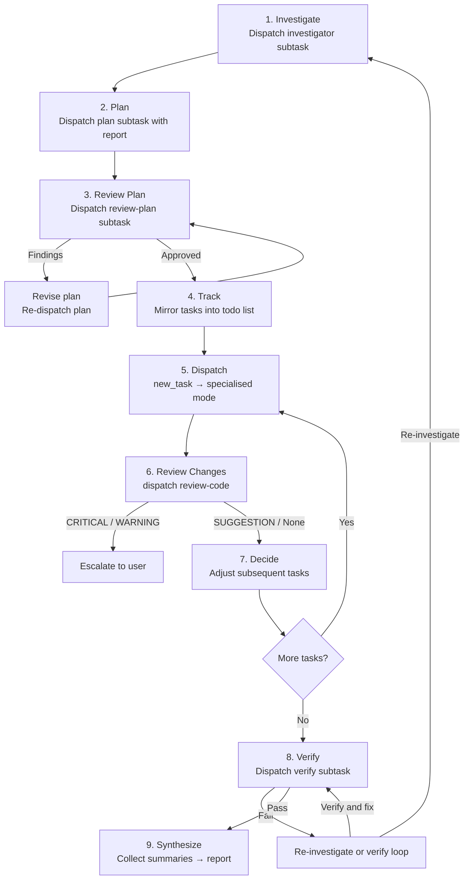

# AI-Snippets: Skills and Agent Mode Synergy

A workspace where **Zoo Code agent modes** collaborate as a multi-agent system and **local skills** drive end-to-end autonomous workflows. This document explains how the pieces fit together.

---

## 1. Overview

The workspace defines two complementary building blocks:

| Layer | What it is | Example |
|-------|-----------|---------|
| **Agent modes** | Specialised Zoo Code subagents, each scoped to a single responsibility (planning, coding, reviewing, verifying, etc.) | [`plan`](modes.json), [`investigator`](modes.json), [`code`](modes.json), [`verify`](modes.json), [`security-review`](modes.json), [`orchestrator`](modes.json) |
| **Local skills** | Reusable prompt-driven runbooks that tell an orchestrator which steps to execute and in what order | [`github-issue`](skills/github-issue.md:1), [`release`](skills/release/SKILL.md:1) |

A **skill** (like `github-issue`) is the *what* — a high-level workflow specification.  
An **orchestrator mode** is the *how* — it knows how to break that workflow into delegated subtasks across the other modes.

Together they form a system where a single human instruction (e.g. "resolve issue #42") triggers an autonomous plan → implement → review → verify → PR cycle without further human input.

---

## Install

The fastest way to get these snippets into your AI coding tool is the published npm package.

```bash
npx @gelse/ai-snippets install <tool> [--global|--local] [--skills-only|--agents-only] [--dry-run] [--yes]
```

Supported tools: `zoo`, `kilo`, `opencode`, `claude`.

Running without arguments launches an interactive wizard — pick a tool, choose global or local scope, confirm.

| Flag | Effect |
|------|--------|
| `--global` (default) | Install to the tool's global config directory |
| `--local` | Install to the local (project-level) config directory |
| `--skills-only` | Install only skills, skip agent modes |
| `--agents-only` | Install only agent modes, skip skills |
| `--dry-run` | Show what would be installed without writing files |
| `--yes` / `-y` | Overwrite existing files without prompting |
| `--help` / `-h` | Show help |

**Collision handling:** When a destination file already exists, the installer prompts you to overwrite, skip, or abort. `--yes` implies overwrite. For zoo global mode, existing modes in `~/.roo/custom_modes.yaml` are preserved — generated modes replace entries with matching slugs, and your other modes stay untouched.

**Non-TTY contract:** On piped or redirected stdin, EOF or an empty answer aborts with exit code 1 rather than silently defaulting to overwrite. Use `--yes` to automate installs in scripts.

Alternatively, clone the repo and build from source:

```bash
git clone https://github.com/gelse/ai-snippets.git && cd ai-snippets
npm install && npm run build
node dist/cli.cjs install <tool> [options]
```

---

## 2. The Orchestrator's Work Loop

The orchestrator mode ([`orchestrator`](modes.json)) never writes code itself. It acts as a strategic coordinator, delegating every concrete action to a specialised subtask and retaining only orchestration-level context. Its workflow follows a fixed loop:



### Step-by-step

| Step | Mode(s) delegated to | Purpose |
|------|---------------------|---------|
| **Investigate** | [`investigator`](modes.json) | Produce an Investigation Report with repository evidence, file references, and resolved open questions |
| **Plan** | [`plan`](modes.json) | Use the Investigation Report to design solution, decompose into ordered implementation tasks |
| **Review Plan** | [`review-plan`](modes.json) | Check plan for completeness, feasibility, correctness; iterate until approved |
| **Track** | *(orchestrator internal)* | Mirror plan tasks into the todo list; respect dependency order |
| **Dispatch** | [`code`](modes.json), [`verify`](modes.json), etc. | Spawn a subtask per implementation task with scope, context, definition of done |
| **Review Changes** | [`review-code`](modes.json) | After each subtask, review only that task's diff for bugs, performance, style |
| **Decide** | *(orchestrator internal)* | Use summaries to adjust remaining tasks or replan if the plan is invalidated |
| **Verify** | [`verify`](modes.json) | Final end-to-end verification; dispatch `verify` to diagnose failures and apply verification-specific fixes, `code` for known implementation fixes |
| **Synthesize** | *(orchestrator internal)* | Collect all subtask summaries into a final human-readable report |

### Failure handling

When verification fails the orchestrator follows a decision tree:

1. Obvious, in-scope failure → let `code` fix it.
2. Unclear or out-of-scope → dispatch `verify`.
3. `verify` finds implementation fix → dispatch `code`.
4. `verify` finds design issue or new evidence is needed → dispatch `investigator` scoped to failure, then dispatch `plan` with new report.
5. Requires human decision → escalate to user.
6. Re-verify after every fix.

---

## 3. End-to-End Autonomous Issue Resolution with `github-issue`

The [`github-issue`](skills/github-issue.md:1) skill combines the orchestrator's loop with GitHub operations to resolve a GitHub issue completely autonomously — from intake to pull request.

### The full autonomous pipeline

| Phase | What happens | Modes involved |
|-------|-------------|----------------|
| **1. Retrieve & Validate** | Fetch issue, comments, labels, linked PRs via `gh`. Stop if ambiguous. | orchestrator (reads only) |
| **2. Feature Branch** | Create a branch referencing the issue. No code yet. | orchestrator (git via `execute_command`) |
| **3. Execute** | Run the standard orchestrator workflow (investigate → plan → review → implement → verify). | orchestrator → `investigator` → `plan` → `review-plan` → `code` → `review-code` → `verify` |
| **4. Commit, Push, PR** | Review final diff, commit, push, open PR referencing the issue. | orchestrator (git/gh via `execute_command`) |
| **5. Report** | Summarize branch, implementation, tests, PR link, limitations. | orchestrator (synthesis) |

### What makes this autonomous

- The skill defines **every phase** as a deterministic step — no human prompting is required between phases.
- The orchestrator delegates **all implementation** to subtasks; it never writes code itself, keeping context lean.
- Zoo Code's auto-approval configuration allows dispatched subtasks and their tool calls (file writes, command execution) to proceed without manual confirmation, so the orchestrator's `new_task` dispatches run unattended from phase to phase.
- The `gh` CLI handles all GitHub interactions (issue retrieval, branch creation, PR creation) without browser or API key prompts.

### The one hard stop

If the original issue contains **material ambiguity** that cannot be resolved from the codebase, comments, or linked references, the skill instructs the orchestrator to **stop immediately** — do not guess, do not modify the repository. This is a deliberate safety valve.

---

## 4. ⚠️ Caveat: Model Selection Matters

**This autonomous pipeline only works reliably if the models backing each mode are chosen carefully.** The orchestrator delegates context-heavy decisions to subtasks; each subtask runs in isolation with only the context it was given. If a subtask is backed by a weak model, the failure mode is silent and cascading.

### What "strong" and "weak" mean here

| Role | Needs | Why |
|------|-------|-----|
| **orchestrator** | Strong reasoning, structured output | Must decompose problems, track state across subtasks, decide next steps from summaries |
| **plan / review-plan** | Strong reasoning, codebase comprehension | Must investigate files, understand architecture, produce actionable task lists |
| **review-code / security-review** | Strong reasoning, attention to detail | Must find real bugs (not style nits), trace data flow, assess exploitability |
| **code** | Strong coding ability, instruction following | Must implement precisely within scope, write tests, run verification |
| **verify** | Strong reasoning + coding | Must diagnose failures, design and run targeted tests, propose targeted fixes |

### What breaks with weak models

| Weak model assigned to… | Failure symptom |
|------------------------|-----------------|
| **orchestrator** | Loses track of subtask results; replans unnecessarily; fails to escalate when it should; dispatches tasks with missing context |
| **plan** | Produces vague, unactionable tasks; misses files; wrong dependency ordering |
| **review-plan** | Approves broken plans; misses CRITICAL findings |
| **code** | Implements outside scope; ignores conventions; skips verification |
| **review-code** | Reports style nits but misses logic bugs; misses security issues |
| **verify** | Misdiagnoses failures; applies incorrect fixes; loops indefinitely; misses missing test coverage |

**Rule of thumb:** The orchestrator and planning/review roles are the highest-leverage model assignments. A weak orchestrator breaks the entire system. A weak coder breaks one task; the orchestrator's review loop can catch and recover from that.

---

## 5. Mode → Model Mapping

The model backing each mode is selected in the Zoo Code settings of the installation running this workspace. The mapping currently in use is shown below; it is the only element of the setup that lives outside this repository.

### Mode → Model table (2026-09-08)

| Mode | Slug | Assigned Model |
|------|------|----------------|
| *(default — all unmapped modes)* | — | **Xiaomi MiMo v2.5** |
| 🪃 Orchestrator | `orchestrator` | **GLM-5.3** |
| 📋 Planner | `plan` | **Xiaomi MiMo V2.5 Pro** |
| 🔍 Investigator | `investigator` | **GLM-5.3 Flash** |
| 💻 Code | `code` | **Xiaomi MiMo v2.5** |
| 🧪 Verify | `verify` | **DeepSeek V4 Flash** |
| 👀 Review Code | `review-code` | **GLM-5.3 Flash** |
| 📋 Review Plan | `review-plan` | **GLM-5.3** |
| 🛡️ Security Review | `security-review` | **DeepSeek V4 Pro** |
| ❓ Ask | `ask` | *(default)* |
| ❌ Debug *(deprecated)* | `debug` | *(default)* |
| ❌ Architect *(deprecated)* | `architect` | *(default)* |

### Impact on autonomy

The mapping above is a deliberate spread, not an accident: each role is backed by the model class its job actually demands.

- **Coordination and planning** (`orchestrator`, `plan`) sit on full-tier reasoning models — decomposition, state tracking, and task design are the highest-leverage decisions in the loop.
- **Implementation** (`code`) runs on the default general-purpose model, which handles instruction-following and edits well.
- **Investigation and verification** (`investigator`, `review-code`, `verify`) sit on flash-tier variants tuned for fast, careful reading of diffs and hypotheses.
- **Highest-stakes judgement** (`security-review`, `review-plan`) is assigned the heaviest available variants, because a missed finding there fails the whole pipeline silently.

The point of this table is not the specific models — those will change over time — but the principle: **never leave the pipeline's roles on a single uniform default.** Autonomy quality is bounded by the weakest model in the loop, and different roles fail in different ways.

---

## Workspace Structure

```
.
├── README.md                  ← this file
├── LICENSE
├── package.json               ← npm package (@gelse/ai-snippets)
├── tsconfig.json
├── tsup.config.ts             ← tsup bundler config
├── modes.json                 ← single source of truth for all custom mode definitions
├── Makefile                   ← build targets: help, verify, zoo/kilo/opencode/claude, manifest, all, clean, install-zoo-*, package-npx
├── src/
│   ├── cli.ts                 ← installer CLI entry point
│   ├── installer.ts           ← core installation logic
│   ├── merge.ts               ← YAML merge for zoo global modes
│   └── prompt.ts              ← readline prompts (collision handling)
├── scripts/
│   ├── generate.py            ← emits tool-specific artifacts into output/
│   ├── verify.py              ← validates modes.json + round-trip check
│   ├── stage-embedded.mjs     ← prebuild: copies output/ into skills-embedded/
│   └── smoke-test.sh          ← installer smoke tests
├── plans/                     ← (local scratch, untracked)
├── .gitignore
├── skills/
│   ├── github-issue.md        ← github-issue skill runbook (flat form)
│   ├── grilling.md            ← grilling skill runbook (flat form)
│   ├── writing-for-humans.md  ← writing-for-humans skill runbook (flat form)
│   └── release/               ← release skill (directory form)
│       ├── SKILL.md           ← release skill runbook
│       ├── release.py         ← release automation CLI (Python)
│       └── release.ts         ← release automation CLI (Node.js)
└── output/                    ← generated tool artifacts (gitignored)
    ├── zoo/                   ← .roomodes + skills/
    ├── kilo/                  ← .kilocodemodes + skills/
    ├── opencode/              ← agents/*.md + skill/*.md
    ├── claude/                ← agents/*.md + skills/<n>/SKILL.md
    └── install-manifest.json  ← per-tool artifact src/local/global path manifest
```

Generated `output/` files are not committed — regenerate with `make all`.

### Dual skill forms

Skills support two layout forms in `modes.json`:

| Form | `file` value | When to use |
|------|-------------|-------------|
| **Flat** | `skills/<name>.md` | Simple skills with just a runbook (e.g. `github-issue`) |
| **Directory** | `skills/<name>/SKILL.md` | Skills that include companion files (scripts, configs) alongside the runbook (e.g. `release/`) |

Both forms emit identically to all tools. `verify.py` enforces that only one form exists per skill name and rejects duplicates or coexistence.

## Skills

Each skill is a reusable prompt-driven runbook. These are the skills included in this workspace:

| Skill | What it does |
|-------|-------------|
| [`github-issue`](skills/github-issue.md:1) | Resolves a GitHub issue end-to-end and opens a pull request. |
| [`grilling`](skills/grilling.md:1) | Stress-tests a plan, decision, or idea through structured questioning before building. |
| [`writing-for-humans`](skills/writing-for-humans.md:1) | Guides writing or editing prose artifacts meant for human readers — docs, READMEs, reports, release notes, specs, emails. |
| [`release`](skills/release/SKILL.md:1) | Releases the testing branch end-to-end — version bump, changelog, PRs to testing and main, and a GitHub release tagged on main. |

### github-issue

Use this skill when a GitHub issue needs to be resolved end-to-end. It retrieves the issue and its context via `gh`, validates that requirements are unambiguous (and stops if they are not), then creates a feature branch off `testing`. After implementation and verification, it commits, pushes, and opens a PR targeting the `testing` branch — referencing the issue number and summarizing the solution.

### grilling

Use this skill before building to stress-test a plan, decision, or idea. It maps the problem as a design tree where every decision branches into dependent sub-decisions, then asks exactly one question at a time — always the most upstream unresolved question — together with a recommended answer. The session ends when every branch of the tree has been visited and nothing is left silently assumed.

### writing-for-humans

Use this skill when writing or editing any prose a human will read: documentation, READMEs, reports, release notes, specs, or emails. It defines a reader profile, then grades every unit of text against four criteria — inverted pyramid (message leads), calibrated (define before use), one message per unit, and load-bearing (every unit earns its place). In review mode, it classifies every finding into a bucket (BURIED, MISCALIBRATED, SPLIT, DEADWEIGHT) and proposes a fix or deletion.

### release

Use this skill to ship a release from the `testing` branch. GitHub access goes through `gh`; git is used locally.

**Workflow:**

1. **Preflight** — validate repo state (clean tree, synced `testing`, tag availability).
2. **Changes** — draft commit/PR summaries; propose a version.
3. **Prepare** — create a release branch, bump the version in `pyproject.toml`, prepend the CHANGELOG section, push, and open a PR to `testing`. The skill reviews the diff and runs tests.
4. **Promote** — after the release PR is merged, open a PR from `testing` to `main`.
5. **Finalize** — after the promotion PR is merged, create a GitHub release tagged on `main` (`vX.Y.Z`).

Two pause gates require the user to merge PRs — the skill never merges itself.

**Deployment:** The helper script [`release.py`](skills/release/release.py:1) is invoked as `.venv/bin/python skills/release/release.py` from the target repo root. It requires **Python ≥ 3.11** in a virtual environment (`tomllib` is stdlib from 3.11; `release.py` imports it). The release skill has no third-party dependencies — a plain venv with Python ≥ 3.11 suffices.

A Node.js alternative [`release.ts`](skills/release/release.ts:1) is compiled alongside the installer CLI and shipped as `dist/release.js` in the npm package. It is invoked as `node dist/release.js <subcommand>` with identical CLI semantics.

---

## Usage

> **Users:** the `npx @gelse/ai-snippets install` command above is the recommended way to install snippets into your tool. The Makefile targets below are for **contributors** working inside this repo — they generate and install artifacts from source.

| Command | What it does |
|---------|-------------|
| `make` | Print help with all available targets |
| `make verify` | Validate [`modes.json`](modes.json) and run round-trip fidelity check; lint `scripts/` and `skills/` with ruff; when both `node` and `npm` are on `PATH`, also run `tsc --noEmit`, `npm run build`, and a zoo dry-run install, otherwise print `SKIP: node not available` |
| `make zoo` | Generate Zoo Code artifacts (`output/zoo/`) |
| `make kilo` | Generate Kilo Code artifacts (`output/kilo/`) |
| `make opencode` | Generate OpenCode artifacts (`output/opencode/`) |
| `make claude` | Generate Claude Code artifacts (`output/claude/`) |
| `make manifest` | Generate the artifact path manifest (`output/install-manifest.json`) |
| `make all` | Generate all four tool artifact trees plus the install manifest |
| `make clean` | Remove `output/` |
| `make package-npx` | Build and pack the npm package (generates artifacts, builds TS, copies release.js, produces tarball in `dist/`) |
| `make package-npx-zoo` | Smoke-test: install zoo via the built package (requires `package-npx`) |
| `make package-npx-kilo` | Smoke-test: install kilo via the built package (requires `package-npx`) |
| `make package-npx-opencode` | Smoke-test: install opencode via the built package (requires `package-npx`) |
| `make package-npx-claude` | Smoke-test: install claude via the built package (requires `package-npx`) |
| `make install-zoo-local` | Install zoo skills and agents locally (project root) |
| `make install-zoo-local-skills` | Install zoo skills locally |
| `make install-zoo-local-agents` | Install zoo agents locally (`.roomodes`) |
| `make install-zoo-global` | Install zoo skills and agents globally (`~/.roo/`) |
| `make install-zoo-global-skills` | Install zoo skills globally |
| `make install-zoo-global-agents` | Install zoo agents globally (overwrites `~/.roo/custom_modes.yaml`) |

### Where generated files go

| Generated path | Tool expects it at |
|----------------|-------------------|
| `output/zoo/.roomodes` | Project root as `.roomodes` |
| `output/zoo/skills/*.md` | `.roo/skills/<name>/SKILL.md` |
| `output/kilo/.kilocodemodes` | Project root as `.kilocodemodes` |
| `output/kilo/skills/*.md` | `.kilo/skills/<name>/SKILL.md` |
| `output/opencode/agents/*.md` | `.opencode/agents/*.md` |
| `output/opencode/skill/*.md` | `.opencode/skills/<name>/SKILL.md` |
| `output/claude/agents/*.md` | `.claude/agents/*.md` |
| `output/claude/skills/<n>/SKILL.md` | `.claude/skills/<n>/SKILL.md` |

Directory-form skills also ship any companion files (scripts, configs) from `skills/<name>/` beside the emitted runbook — e.g. `output/zoo/skills/release/release.py`, `output/kilo/skills/release/release.py`, `output/opencode/skill/release/release.py`, and `output/claude/skills/release/release.py`. The `install-zoo-*-skills` targets copy these alongside `SKILL.md`.

### Deploy to Zoo Code

Zoo Code reads modes and skills from both per-project and global locations. Use per-project paths when you want to check the config into a repository; use global paths to make the same modes and skills available in all projects on your machine. A project-level mode with the same slug completely overrides its global counterpart; likewise, a project-level skill overrides a same-named global skill.

Modes: `.roomodes` in the project root (YAML or JSON) or the global `custom_modes.yaml` / `custom_modes.json` config (edited via Modes page → "Edit Global Modes").
Skills: `.roo/skills/<name>/SKILL.md` (per-project) or `~/.roo/skills/<name>/SKILL.md` (Zoo-specific global). There is also a cross-agent global location `~/.agents/skills/<name>/SKILL.md` shared with other agent tools.

**Per-project deploy** (add to the project repo):

```bash
make install-zoo-local          # installs both skills and agents
```

Or install individually:

```bash
make install-zoo-local-skills   # only skills
make install-zoo-local-agents   # only agents (.roomodes)
```

**Global deploy** (available to all projects for your user):

```bash
make install-zoo-global          # installs both skills and agents
```

Or install individually:

```bash
make install-zoo-global-skills   # only skills
make install-zoo-global-agents   # only agents (⚠ overwrites ~/.roo/custom_modes.yaml)
```

> **Note:** `install-zoo-global-agents` overwrites the entire `~/.roo/custom_modes.yaml` file with the generated modes. Any existing global modes not present in the generated file will be lost.

### Deploy to Kilo Code

Kilo Code reads modes and skills from both per-project and global locations. Use per-project paths when you want to check the config into a repository; use global paths to make the same modes and skills available in all projects on your machine. A project-level mode with the same slug completely overrides its global counterpart; likewise, a project-level skill overrides a same-named global skill.

Modes: `.kilocodemodes` (YAML or JSON) in the project root — this is the legacy format; current Kilo Code versions read it and auto-migrate it to Markdown agent files on startup. Global modes live as Markdown agent files in `~/.config/kilo/agent/`.
Skills: `.kilo/skills/<name>/SKILL.md` (per-project) or `~/.kilo/skills/<name>/SKILL.md` (global).

**Per-project deploy** (add to the project repo):

```bash
make kilo
cp output/kilo/.kilocodemodes .kilocodemodes
for f in output/kilo/skills/*.md; do
  n=$(basename "$f" .md)
  mkdir -p .kilo/skills/"$n"
  cp "$f" .kilo/skills/"$n"/SKILL.md
done
```

**Global deploy** (available to all projects for your user):

```bash
make kilo
mkdir -p ~/.kilo/skills
for f in output/kilo/skills/*.md; do
  n=$(basename "$f" .md)
  mkdir -p ~/.kilo/skills/"$n"
  cp "$f" ~/.kilo/skills/"$n"/SKILL.md
done
```

For global modes, there is no single file to copy — modes live as individual Markdown agent files in `~/.config/kilo/agent/`. Open the Kilo Code Modes view and paste or import the modes from `output/kilo/.kilocodemodes` into the global modes editor, or copy them manually into `~/.config/kilo/agent/`.

### Deploy to OpenCode

OpenCode reads agents and skills from both per-project and global locations. Use per-project paths when you want to check the config into a repository; use global paths to make the same agents and skills available in all projects on your machine.

Agents: `.opencode/agents/*.md` (per-project) or `~/.config/opencode/agents/*.md` (global) — [docs](https://opencode.ai/docs/agents/).
Skills: `.opencode/skills/<name>/SKILL.md` (per-project) or `~/.config/opencode/skills/<name>/SKILL.md` (global) — [docs](https://opencode.ai/docs/skills/).

**Per-project deploy** (add to the project repo):

```bash
make opencode
mkdir -p .opencode/agents
cp output/opencode/agents/*.md .opencode/agents/
for f in output/opencode/skill/*.md; do
  n=$(basename "$f" .md)
  mkdir -p .opencode/skills/"$n"
  cp "$f" .opencode/skills/"$n"/SKILL.md
done
```

**Global deploy** (available to all projects for your user):

```bash
make opencode
mkdir -p ~/.config/opencode/agents
cp output/opencode/agents/*.md ~/.config/opencode/agents/
for f in output/opencode/skill/*.md; do
  n=$(basename "$f" .md)
  mkdir -p ~/.config/opencode/skills/"$n"
  cp "$f" ~/.config/opencode/skills/"$n"/SKILL.md
done
```

> Extra skill sources can also be configured via a `"skills"` array in `opencode.json`.

### Deploy to Claude Code

Claude Code reads agents and skills from both per-project and global locations. Use per-project paths when you want to check the config into a repository; use global paths to make the same agents and skills available in all projects on your machine. A project-level agent with the same name takes priority over its global counterpart; likewise, a project-level skill overrides a same-named global skill. If an agents directory is created while a session is running, Claude Code must be restarted to detect the new subagents.

Agents: `.claude/agents/*.md` (per-project) or `~/.claude/agents/*.md` (global).
Skills: `.claude/skills/<name>/SKILL.md` (per-project) or `~/.claude/skills/<name>/SKILL.md` (global).

**Install**

- **Per-project (devcontainer):** add the feature to your `.devcontainer.json` — `"features": { "ghcr.io/anthropics/devcontainer-features/claude-code:1.0": {} }` — which installs the latest CLI and VS Code extension into the project container.
- **Global (npm):** `npm install -g @anthropic-ai/claude-code` — requires Node.js 22 or later; avoid `sudo` to prevent permission issues.
- **Global (native installer, recommended):** `curl -fsSL https://claude.ai/install.sh | bash` for macOS/Linux/WSL (Windows PowerShell: `irm https://claude.ai/install.ps1 | iex`). Native installations auto-update in the background and are the fallback when npm produces permission errors.

**Per-project deploy** (add to the project repo):

```bash
make claude
mkdir -p .claude/agents .claude/skills
cp -r output/claude/agents/* .claude/agents/
cp -r output/claude/skills/* .claude/skills/
```

**Global deploy** (available to all projects for your user):

```bash
make claude
mkdir -p ~/.claude/agents ~/.claude/skills
cp -r output/claude/agents/* ~/.claude/agents/
cp -r output/claude/skills/* ~/.claude/skills/
```

---

## Developer Notes

The npm package (`@gelse/ai-snippets`) is built with [tsup](https://tsup.egoist.dev/) and bundled into `dist/`.

| Command | What it does |
|---------|-------------|
| `npm run build` | Runs the prebuild step (stages `skills-embedded/` from `output/`) then bundles `dist/cli.cjs` (CommonJS, for the `ai-snippets` bin) and `dist/release.js` (ESM) via tsup |
| `bash scripts/smoke-test.sh` | Runs the installer against temporary `$HOME` dirs — dry-run, real install, collision prompts, abort, piped stdin, `--yes` overwrite, EOF non-zero exit |
| `npm pack --dry-run` | Shows what the published tarball contains (`dist/` + `skills-embedded/` only) |

The prebuild step ([`scripts/stage-embedded.mjs`](scripts/stage-embedded.mjs)) copies `output/` into `skills-embedded/`, which tsup bundles into the published package. You need `make all` to generate `output/` before `npm run build` will succeed.

`make verify` now includes a node-optional block: when both `node` and `npm` are on `PATH`, it runs `tsc --noEmit`, `npm run build`, and a dry-run install of zoo; otherwise it prints `SKIP: node not available` and continues with the Python checks.

---

## Gaps and downsides /  FAQ

This documentation — and the workflow it describes — is a work in progress. Known gaps:

- **Tests are probably underrepresented in their importance.** The verify phase now includes a diagnostic loop — `verify` can create or improve tests, diagnose failures, and apply verification-specific fixes before escalating to `code`. Still, the pipeline does not yet enforce test-first delegation, where each dispatched task carries executable acceptance criteria. Expect the loop to evolve toward that model.

- **Mode definitions require ongoing maintenance** All orchestrator workflow modes now have custom instructions in [`modes.json`](modes.json), but as workflows evolve, the definitions need regular review to stay aligned with actual orchestrator behavior.

- **Overthinking** Even small tasks that would not need extensive planning are going through the plan/review plan loop, which is nice to look at, but probably completely useless. The solution is to either NOT use the orchestrator as the starting point (for small single-agent tasks) or tell the orchestrator in the prompt to not go through all the hoops in planning (because - for example - you already have a implementation plan ready).

- **Zoo Code only: orchestrator loses grip on subtasks** There seems to be a bug in Zoo Code that if a subtask gets interrupted (by human interaction, for example, or by loss of network connection or any other reason) and restarted again, the subtask finishes, but does not report it's results to the orchestrator. The workaround is: open the result of the subtask (only the result) as markdown, save it as file somewhere and tell the orchestrator something like "Subtask failed to respond properly, results can be found at `plans/000-results.md`". The orchestrator then continues it's work as if it got the results directly from the subtask.

- **Model assign examples are fluid** As new models evolve nearly every week, at least every month, i am experimenting a lot with re-assigning. For example: flash-tier and on-prem models are frequently rotated into various roles as they become available. Because i have a combination of different providers glued together with on-prem [Bifrost AI Gateway](https://docs.getbifrost.ai/overview) i try to find the most cost-effective solution and switch around using my quota from different services a lot.
