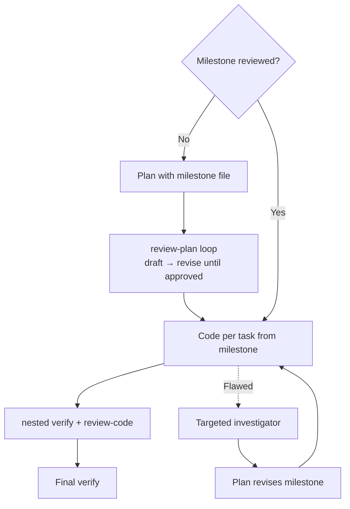

# Orchestrator Workflow

This document covers the captain entry point, the orchestrator's shared execution playbook, the task-type skills, the `github-issue` autonomous pipeline, and model-selection philosophy.

## Captain

The captain is the default entry point. It classifies the task into one of five types, dispatches the orchestrator as a subtask carrying the chosen skill, and supervises execution.

### Classification

Captain reads the user's request, gathers minimal evidence (file references, branches, issues, milestones), and matches symptoms to a task type:

| Symptoms | Type | Skill |
|----------|------|-------|
| Multi-part, design-heavy; multiple files/components; architecture decisions | Full feature | `full-feature` |
| Single, contained, obvious; one file or a few files; no design ambiguity | Small feature | `small-feature` |
| Plan-only; no implementation requested; architecture or research | Architecture | `architecture` |
| Defect or broken behavior; regression; reproduction test needed | Bugfix | `bugfix` |
| Approved milestone file exists under `plans/` and maps to the task | Implementation from milestone | `implementation-from-milestone` |

**Tiebreak:** If two types fit, prefer the smaller one. If evidence is missing to decide, investigate first; do not guess.

### Dispatch and supervision

Captain dispatches the orchestrator via `new_task` with the original request, the classified skill, and relevant evidence. The orchestrator loads the named skill and executes its workflow.

Captain monitors the orchestrator's completion summary and verifies that the dispatched skill's workflow was followed and completion criteria were met.

### Re-classification

If verify finds a design-level cause, or the task outgrows its classification, this is misclassification evidence — captain re-classifies and re-dispatches with the corrected skill, preserving all completed work.

Captain's mode definition is instruction-level read-only (`[read, command, mcp]` groups); no tool-enforced edit restrictions are claimed.

## Skills

The orchestrator dispatches exactly one skill per run. Each skill defines a workflow sequence, type-specific rules, and a failure-recovery table. The orchestrator loads the skill via the `skill` tool and follows it end-to-end.

### Full feature

**Workflow:** `investigator → plan (nested review-plan) → milestone files under plans/ → code per milestone (nested verify + review-code) → final verify`

**Key rules:** Use the `grilling` skill in plan dispatch when human input is needed. Milestone files use the format defined in plan mode. Code dispatches are per milestone file. Final verify covers cross-task integration.

**Recovery:** Unclear failure → verify. Implementation cause → code → verify. Design issue → targeted investigator → plan → re-dispatch code → verify. Evidence gap in plan review → targeted investigator → plan → re-review.

### Small feature

**Workflow:** `code (nested verify; unit tests required; nested review-code when risky or externally visible)`

**Key rules:** Single code dispatch. No investigator or plan. Unit tests are mandatory.

**Recovery:** Obvious failure → code → verify. Unclear failure → verify. Implementation cause → code → verify. Design issue or scope growth → report to captain for re-classification.

### Architecture

**Workflow:** `investigator → plan (nested review-plan) → milestone files under plans/` — no implementation dispatch.

**Key rules:** Always use the `grilling` skill in plan dispatch. Milestone format per plan mode. Completion = approved milestone files.

**Recovery:** Evidence gap in plan review → targeted investigator → plan → re-review.

### Bugfix

**Workflow:** `code (failing reproduction test first → fix → nested verify) → final verify`

**Key rules:** Reproduction test fails before fix, passes after. Minimal fix — no unrelated refactoring.

**Recovery:** Same as small feature: obvious failure → code → verify; unclear failure → verify; implementation cause → code → verify; design issue → report to captain for re-classification.

### Implementation from milestone

**Workflow:** `code per task directly from plans/<milestone>.md → final verify`

Milestone not yet reviewed → dispatch `plan` with the existing milestone file (plan runs its nested review-plan loop). Milestone flawed mid-implementation → targeted investigator → plan (nested review-plan) → re-dispatch code.

**Key rules:** Milestone format per plan mode. Code uses `Verification` and `Non-goals` fields as its dispatch contract. Final verify covers cross-task integration.

**Recovery:** Obvious failure → code → verify. Unclear failure → verify. Implementation cause → code → verify. Design issue → targeted investigator → plan → re-dispatch code → verify.

## Milestones

Milestone files live in `plans/` (local, gitignored). Each file is one implementation-ready unit produced or revised by `plan`. The canonical format is defined in [plan mode](../agents/plan.md#milestone-file-output-architectureplanning-tasks) — orchestrator, skills, and `code` reference it by name and do not restate it.

## End-to-End Autonomous Issue Resolution with `github-issue`

The [`github-issue`](../skills/github-issue.md) skill combines the orchestrator's loop with GitHub operations to resolve a GitHub issue completely autonomously — from intake to pull request.

### The Full Autonomous Pipeline

| Phase | What happens | Modes involved |
|-------|-------------|----------------|
| **1. Retrieve & Validate** | Fetch issue, comments, labels, linked PRs via `gh`. Stop if ambiguous. | orchestrator (reads only) |
| **2. Feature Branch** | Create a branch referencing the issue, starting at the remote testing branch. No code yet. | orchestrator (git via `execute_command`) |
| **3. Classify & Execute** | Hand the validated issue to captain. Captain classifies the issue type and dispatches the orchestrator with the matching skill. The skill context (this orchestrator run) owns the git/gh phases — branch, commit/push, PR; the captain subtask and its orchestrator dispatch run only the classified workflow. | orchestrator → captain → orchestrator with skill |
| **4. Commit, Push, PR** | Review final diff, commit, push, open PR to the testing branch referencing the issue. | orchestrator (git/gh via `execute_command`) |
| **5. Report** | Summarize branch, implementation, tests, PR link, limitations. | orchestrator (synthesis) |

### What Makes This Autonomous

- The skill defines **every phase** as a deterministic step — no human prompting is required between phases.
- The orchestrator delegates **all implementation** to subtasks; it never writes code itself, keeping context lean.
- Nested sub-task spawning keeps review/verify context small — each gate runs against only its task's scope, not the entire change set.
- Zoo Code's auto-approval configuration allows dispatched subtasks and their tool calls to proceed without manual confirmation.
- The `gh` CLI handles all GitHub interactions without browser or API key prompts.

### The One Hard Stop

If the original issue contains **material ambiguity** that cannot be resolved from the codebase, comments, or linked references, the skill instructs the orchestrator to **stop immediately** — do not guess, do not modify the repository. This is a deliberate safety valve.

## Model Selection Philosophy

**This autonomous pipeline only works reliably if the models backing each mode are chosen carefully.** The orchestrator delegates context-heavy decisions to subtasks; each subtask runs in isolation with only the context it was given. A weak model produces a silent, cascading failure. Agents that spawn nested sub-tasks (`plan`, `code`) need instruction-following strong enough to manage their own quality gates.

### What "Strong" and "Weak" Mean Here

| Role | Needs | Why |
|------|-------|-----|
| **captain** | Full-tier reasoning | Must classify tasks accurately, detect misclassification, supervise orchestrator output |
| **orchestrator** | Strong reasoning, structured output | Must load and follow skills, track state across subtasks, decide next steps from summaries |
| **plan / review-plan** | Strong reasoning, codebase comprehension | Must investigate files, understand architecture, produce actionable task lists; plan also manages nested review loop |
| **review-code / security-review** | Strong reasoning, attention to detail | Must find real bugs, trace data flow, assess exploitability |
| **code** | Strong coding ability, instruction following | Must implement precisely within scope, write tests, run verification, and manage nested quality gates |
| **verify** | Strong reasoning + coding | Must diagnose failures, design and run targeted tests, propose targeted fixes |

### What Breaks with Weak Models

| Weak model assigned to… | Failure symptom |
|------------------------|-----------------|
| **captain** | Misclassifies tasks; fails to detect scope growth; dispatches wrong skill |
| **orchestrator** | Loses track of subtask results; replans unnecessarily; fails to escalate; dispatches tasks with missing context |
| **plan** | Produces vague, unactionable tasks; misses files; wrong dependency ordering; fails to manage nested review loop |
| **review-plan** | Approves broken plans; misses CRITICAL findings |
| **code** | Implements outside scope; ignores conventions; skips or mishandles nested quality gates |
| **review-code** | Reports style nits but misses logic bugs; misses security issues |
| **verify** | Misdiagnoses failures; applies incorrect fixes; loops indefinitely |

**Rule of thumb:** The captain and orchestrator are the highest-leverage model assignments. A weak captain breaks the entire system through misclassification. A weak orchestrator breaks skill execution. A weak coder breaks one task; the orchestrator's review loop can catch and recover from that.

### Mode → Model Mapping

The model backing each mode is selected in the tool's settings. The principle: **never leave the pipeline's roles on a single uniform default.** Autonomy quality is bounded by the weakest model in the loop, and different roles fail in different ways.

| Mode | Role | Model Class |
|------|------|-------------|
| `captain` | Classification + supervision | Full-tier reasoning |
| `orchestrator` | Shared execution playbook | Full-tier reasoning |
| `plan` | Design + decomposition | Full-tier reasoning |
| `review-plan` | Plan validation | Heavy-tier reasoning |
| `investigator` | Evidence gathering | Flash-tier fast reading |
| `code` | Implementation | General-purpose |
| `verify` | Testing + diagnosis | Flash-tier fast reading |
| `review-code` | Code review | Flash-tier fast reading |
| `security-review` | Security review | Heavy-tier reasoning |

The specific models will change over time — the principle is what matters: match each role to the model class its job demands.
