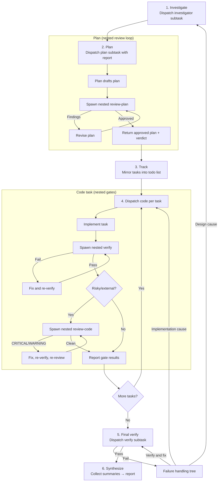

# Orchestrator Workflow

This document covers the orchestrator work loop, the `github-issue` autonomous pipeline, and model-selection philosophy.

## The Orchestrator's Work Loop

The orchestrator mode never writes code itself. It acts as a strategic coordinator, delegating every concrete action to a specialized subtask and retaining only orchestration-level context. Any agent can now spawn nested sub-tasks via `new_task`, keeping review/verify context small by scoping it to individual tasks.



### Step-by-step

| Step | Dispatched by | Mode(s) delegated to | Purpose |
|------|--------------|---------------------|---------|
| **Investigate** | orchestrator | `investigator` | Produce an investigation report with repository evidence, file references, and resolved open questions |
| **Plan** | orchestrator | `plan` | Use the investigation report to design solution, decompose into ordered implementation tasks |
| **Plan Review** | *plan (nested)* | `review-plan` | Plan spawns its own review loop; orchestrator receives only the approved plan + verdict |
| **Track** | orchestrator | *(internal)* | Mirror plan tasks into the todo list; respect dependency order |
| **Dispatch code** | orchestrator | `code` | Spawn a subtask per implementation task with scope, context, definition of done |
| **Per-task verify** | *code (nested)* | `verify` | Code spawns scoped verify for its task; fixes and re-runs until clean |
| **Per-task review** | *code (nested)* | `review-code` | For non-trivial/risky changes, code spawns scoped review; resolves findings before completing |
| **Final verify** | orchestrator | `verify` | End-to-end cross-task verification after all tasks complete |
| **Synthesize** | orchestrator | *(internal)* | Collect all subtask summaries into a final human-readable report |

### Mode Sequence Diagram

The sequence diagram below shows the workflow as interactions between modes; each mode is a participant/lifeline. `plan` and `code` own their nested review gates, while the orchestrator dispatches and routes between modes.

```mermaid
sequenceDiagram
    participant ORCH as orchestrator
    participant INV as investigator
    participant PLAN as plan
    participant RP as review-plan
    participant CODE as code
    participant VER as verify
    participant RC as review-code

    ORCH->>INV: dispatch investigation (with request)
    activate INV
    INV-->>ORCH: evidence report
    deactivate INV

    ORCH->>PLAN: dispatch planning (with report)
    activate PLAN
    loop until approved (max 2 rounds)
        PLAN->>RP: spawn nested review-plan
        activate RP
        RP-->>PLAN: findings or APPROVE
        deactivate RP
        PLAN->>PLAN: revise plan (on findings)
    end
    PLAN-->>ORCH: approved plan + verdict
    deactivate PLAN

    ORCH->>ORCH: track tasks in todo list

    loop each task
        ORCH->>CODE: dispatch task (scope, context, done)
        activate CODE
        CODE->>CODE: implement
        CODE->>VER: spawn nested verify (scoped to task)
        activate VER
        alt fail
            VER-->>CODE: failure diagnosis
            deactivate VER
            CODE->>CODE: fix and re-verify
        else pass
            deactivate VER
        end
        opt non-trivial/risky/external
            CODE->>RC: spawn nested review-code
            activate RC
            RC-->>CODE: findings or clean
            deactivate RC
            alt CRITICAL/WARNING
                CODE->>CODE: fix, re-verify, re-review
            end
        end
        CODE-->>ORCH: gate results
        deactivate CODE
    end

    ORCH->>VER: final end-to-end verify
    activate VER
    alt fail
        VER-->>ORCH: failure diagnosis
        deactivate VER
        note over ORCH: failure tree → code fix / investigator+plan / escalate
    else pass
        VER-->>ORCH: pass
        deactivate VER
    end

    ORCH->>ORCH: synthesize report
```

### Failure Handling

Per-task failures are handled inside the `code` sub-task via nested quality gates. The orchestrator handles final-verify failures:

1. Obvious, in-scope failure → let `code` fix it.
2. Unclear or out-of-scope → dispatch `verify`.
3. `verify` finds implementation fix → dispatch `code`.
4. `verify` finds design issue or new evidence → dispatch `investigator` scoped to failure, then dispatch `plan` (with nested plan-review).
5. Requires human decision → escalate to user.
6. Re-verify after every fix.

## End-to-End Autonomous Issue Resolution with `github-issue`

The [`github-issue`](../skills/github-issue.md) skill combines the orchestrator's loop with GitHub operations to resolve a GitHub issue completely autonomously — from intake to pull request.

### The Full Autonomous Pipeline

| Phase | What happens | Modes involved |
|-------|-------------|----------------|
| **1. Retrieve & Validate** | Fetch issue, comments, labels, linked PRs via `gh`. Stop if ambiguous. | orchestrator (reads only) |
| **2. Feature Branch** | Create a branch referencing the issue. No code yet. | orchestrator (git via `execute_command`) |
| **3. Execute** | Run the standard orchestrator workflow: investigate → plan (with nested review-plan) → implement per task (each with nested verify/review-code) → final verify. | orchestrator → `investigator` → `plan` (nested `review-plan`) → `code` (nested `verify` + `review-code`) → `verify` |
| **4. Commit, Push, PR** | Review final diff, commit, push, open PR referencing the issue. | orchestrator (git/gh via `execute_command`) |
| **5. Report** | Summarize branch, implementation, tests, PR link, limitations. | orchestrator (synthesis) |

### What Makes This Autonomous

- The skill defines **every phase** as a deterministic step — no human prompting is required between phases.
- The orchestrator delegates **all implementation** to subtasks; it never writes code itself, keeping context lean.
- Nested sub-task spawning keeps review/verify context small — each gate runs against only its task's scope, not the entire change set.
- Zoo Code's auto-approval configuration allows dispatched subtasks and their tool calls to proceed without manual confirmation.
- The `gh` CLI handles all GitHub interactions without browser or API key prompts.

### The One Hard Stop

If the original issue contains **material ambiguity** that cannot be resolved from the codebase, comments, or linked references, the skill instructs the orchestrator to **stop immediately** — do not guess, do not modify the repository. This is a deliberate safety valve.

## Model Selection Philosophy

**This autonomous pipeline only works reliably if the models backing each mode are chosen carefully.** The orchestrator delegates context-heavy decisions to subtasks; each subtask runs in isolation with only the context it was given. A weak model produces a silent, cascading failure. Agents that spawn nested sub-tasks (`plan`, `code`) need instruction-following strong enough to manage their own quality gates.

### What "Strong" and "Weak" Mean Here

| Role | Needs | Why |
|------|-------|-----|
| **orchestrator** | Strong reasoning, structured output | Must decompose problems, track state across subtasks, decide next steps from summaries |
| **plan / review-plan** | Strong reasoning, codebase comprehension | Must investigate files, understand architecture, produce actionable task lists; plan also manages nested review loop |
| **review-code / security-review** | Strong reasoning, attention to detail | Must find real bugs, trace data flow, assess exploitability |
| **code** | Strong coding ability, instruction following | Must implement precisely within scope, write tests, run verification, and manage nested quality gates |
| **verify** | Strong reasoning + coding | Must diagnose failures, design and run targeted tests, propose targeted fixes |

### What Breaks with Weak Models

| Weak model assigned to… | Failure symptom |
|------------------------|-----------------|
| **orchestrator** | Loses track of subtask results; replans unnecessarily; fails to escalate; dispatches tasks with missing context |
| **plan** | Produces vague, unactionable tasks; misses files; wrong dependency ordering; fails to manage nested review loop |
| **review-plan** | Approves broken plans; misses CRITICAL findings |
| **code** | Implements outside scope; ignores conventions; skips or mishandles nested quality gates |
| **review-code** | Reports style nits but misses logic bugs; misses security issues |
| **verify** | Misdiagnoses failures; applies incorrect fixes; loops indefinitely |

**Rule of thumb:** The orchestrator and planning/review roles are the highest-leverage model assignments. A weak orchestrator breaks the entire system. A weak coder breaks one task; the orchestrator's review loop can catch and recover from that.

### Mode → Model Mapping

The model backing each mode is selected in the tool's settings. The principle: **never leave the pipeline's roles on a single uniform default.** Autonomy quality is bounded by the weakest model in the loop, and different roles fail in different ways.

| Mode | Role | Model Class |
|------|------|-------------|
| `orchestrator` | Coordination | Full-tier reasoning |
| `plan` | Design + decomposition | Full-tier reasoning |
| `review-plan` | Plan validation | Heavy-tier reasoning |
| `investigator` | Evidence gathering | Flash-tier fast reading |
| `code` | Implementation | General-purpose |
| `verify` | Testing + diagnosis | Flash-tier fast reading |
| `review-code` | Code review | Flash-tier fast reading |
| `security-review` | Security review | Heavy-tier reasoning |

The specific models will change over time — the principle is what matters: match each role to the model class its job demands.
